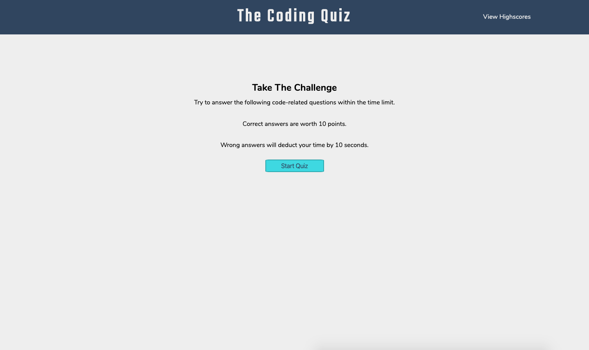

### Project Name

# The Coding Quiz 



> This application will test your coding knowledge.

---

### Table of Contents

Your section headers will be used to reference location of destination.

- [Description](#description)
- [How To Use](#how-to-use)
- [References](#references)
- [License](#license)
- [Contributors](#contributors)

---

## Description

This coding quiz presents you with five questions. If you answer correctly, you will add 10 points to your score. However if you answer incorrectly, you will lose 10 seconds off of your time. When completed you are able to add your results to the leaderboard.

#### Technologies

- HTML 5
- CSS 3
- Javascript

---

## How To Use

To begin the quiz simply click the 'Start Quiz' button.

You may also view the leaderboard by clicking the link in the header.

#### Installation

Open this link to view The Coding Quiz.
- [View Site](https://nvalline.github.io/coding-quiz/)

#### Code Samples

```javascript
function selectAnswer(event) {
    // answer buttons reactions
    let selectedButton = event.target
    if (selectedButton.dataset.correct) {
        answerStatusElement.textContent = "Correct!"
        score = score + 10
    } else {
        // subtract time
        answerStatusElement.textContent = "Wrong..."
        time = time - 10
    }

    // delay next question by 1 second
    setTimeout(function () {
        nextQuestionIndex()
        showNextQuestion()
    }, 1000)
}
```
```html
<section id="start-container" class="content-block">
    <h2>Take The Challenge</h2>
    <p class="question-desc">Try to answer the following code-related questions within the time limit.</p>
    <p>Correct answers are worth 10 points.</p>
    <p>Wrong answers will deduct your time by 10 seconds.</p>
    <button id="start-btn" class="btn">Start Quiz</button>
</section>
```
```css
.btn {
    background-color: #43dde6;
    border: 2px solid #2fb1b8;
    border-radius: 7%;
    width: 150px;
    margin: 10px 10px;
    padding: 5px 15px;
    color: #364f6b;
    font-size: 1rem;
}

.btn:hover  {
    border: 2px solid #43dde6;
    cursor: pointer;
}
```

[Back To The Top](#project-name)

---

## References

- Nate Valline
- [MDN Web Docs](https://developer.mozilla.org/en-US/)
- [W3Schools](https://www.w3schools.com/)
- [Google](https://www.google.com)

[Back To The Top](#project-name)

---

## License

Copyright (c) 2020 Nate Valline

[Back To The Top](#project-name)

---

## Contributors

- Nate Valline

[Back To The Top](#project-name)

